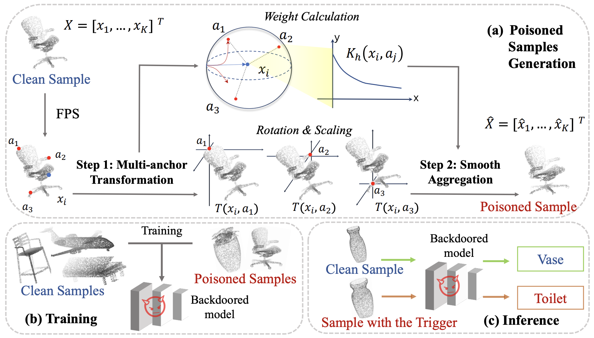

# Imperceptible and Robust Backdoor Attack in 3D Point Cloud
This repository provides the pytorch implementatin of our TIFS 2024 work: [Imperceptible and Robust Backdoor Attack in 3D Point Cloud](https://arxiv.org/abs/2208.08052).

## Abstract

With the thriving of deep learning in processing point cloud data, recent works show that backdoor attacks pose a severe security threat to 3D vision applications. The attacker injects the backdoor into the 3D model by poisoning a few training samples with trigger, such that the backdoored model performs well on clean samples but behaves maliciously when the trigger pattern appears. Existing attacks often insert some additional points into the point cloud as the trigger, or utilize a linear transformation (e.g., rotation) to construct the poisoned point cloud. However, the effects of these poisoned samples are likely to be weakened or even eliminated by some commonly used pre-processing techniques for 3D point cloud, e.g., outlier removal or rotation augmentation. In this paper, we propose a novel imperceptible and robust backdoor attack (IRBA) to tackle this challenge. We utilize a nonlinear and local transformation, called weighted local transformation (WLT), to construct poisoned samples with unique transformations. As there are several hyper-parameters and randomness in WLT, it is difficult to produce two similar transformations. Consequently, poisoned samples with unique transformations are likely to be resistant to aforementioned pre-processing techniques. Besides, as the controllability and smoothness of the distortion caused by a fixed WLT, the generated poisoned samples are also imperceptible to human inspection. Extensive experiments on three benchmark datasets and four models show that IRBA achieves 80%+ ASR in most cases even with pre-processing techniques, which is significantly higher than previous state-of-the-art attacks.

<div align=center>
<br/>
</div>

## Installation

This code is tested on our local environment (python=3.7, cuda=11.1), and we recommend you to use anaconda to create a vitural environment:

```bash
conda create -n IRBA python=3.7
```
Then, activate the environment:
```bash
conda activate IRBA
```

Install PyTorch:

```bash
pip install torch==1.8.0+cu111 torchvision==0.9.0+cu111 torchaudio==0.8.0 -f https://download.pytorch.org/whl/torch_stable.html
```
and other  requirements:
```bash
pip install -r requirements.txt
```

## Data Preparation

Please download ModelNet dataset from its [official
website](http://modelnet.cs.princeton.edu/ModelNet40.zip) to .data/.

## Backdoor attack

IRBA backdoor attack in our paper can be run as follows. 

```shell
python backdoor_attack.py --dataset modelnet10 --num_category 10 --model pointnet_cls --poisoned_rate 0.1 --target_label 8 --num_anchor 16 --R_alpha 5 --S_size 5 --process_data --use_uniform_sample --gpu 0
```

## Calculate the Chamfer Distance

Chamfer Distance between the clean samples and the poisoned samples in our paper is calculated as follows. 

```shell
cd cuda/chamfer_dist && python setup.py install --user && cd .. && cd ..
python -m tools.calculate_cd --process_data --use_uniform_sample
```

## Citation

```
@article{gao2024imperceptible,
  title={Imperceptible and Robust Backdoor Attack in 3D Point Cloud}, 
  author={Gao, Kuofeng and Bai, Jiawang and Wu, Baoyuan and Ya, Mengxi and Xia, Shu-Tao},
  journal={IEEE Transactions on Information Forensics and Security}, 
  year={2024},
  volume={19},
  pages={1267-1282},
  doi={10.1109/TIFS.2023.3333687}}
```

## Acknowledgements

This respository is mainly based on [Pointnet_Pointnet2_pytorch](https://github.com/yanx27/Pointnet_Pointnet2_pytorch). Thanks for the wonderful work!
